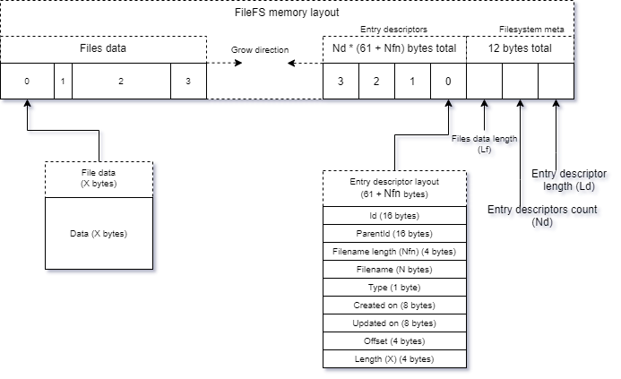

# Architecture overview

## Code structure

FileFS client library consists of 2 main projects:
- `FileFS.DataAccess`: low-level services
- `FileFS.Client`: high-level ready-to-use client API

`FileFS.DataAccess` consits of number of services, such as
- serializers: helps to serialize and deserialize data to binary view and back
- repositories: classes to work with related data entities
- allocation services: allocation related stuff, such as file allocator and optimizer
- other stuff

`FileFS.Client` contains:
- `FileFsClient`, `IFileFsClient`: implementation and abstraction for internal files (files inside FileFS) management
- `ExternalFileManager`, `IExternalFileManager`: implementation and abstractino for external file (file in you filesystem) management
- other: such as factories and other boilerplate stuff

## Memory organization

Each FileFS storage file has such memory structure:

- **File system descriptor**: describes internal metadata of the filesystem
- **Entry descriptor**: describes metadata of file or directory
- **File data**: data actually

Main point here - file data starts and **grows from beginning** of the file, filesystem descriptor, file descriptors - **from the end**. That allows distinguish those 2 memory types very easily.

## Allocation

For file data allocation - custom linear allocator is used. It allows to easily allocate any amount of bytes without blocks, but also easily leads to defragmentation.
But implementation of linear allocator in FileFS has some custom logic - before allocation data at the end it tries to find gap of matched size between actual data.
Such method decrease degree of fragmentation.

## Memory optimization

When storage grows, there will be multiple gaps that was left by deleted data. Those gaps could be optimized using optimization process (deallocated).

Optimization process in FileFS simply cuts off such gaps, moving near data together.

Example (numbers are counts of file data bytes):

### `|12|_|23|_|_|` -> `|12|23|`

Optimization process will be automatically called on create/update/import/export operations when space left to new files is less that new data size. Optimization could be also called manually.
